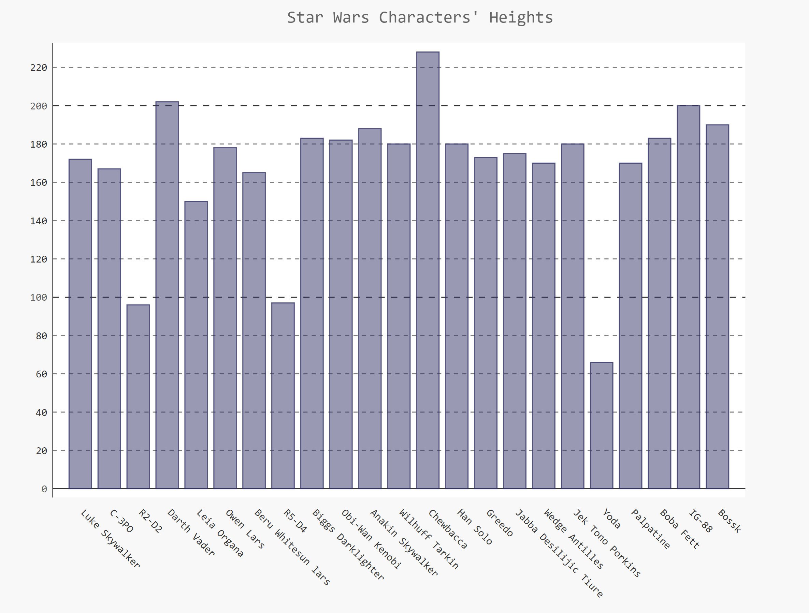

# StarWarsApiDataVisualization
Using Python Requests and Json libraries to make an API call to the Star Wars API and create data visualizations with the results.

## Goals:
1. Get comfortable accessing APIs
2. Navigate and successfully use JSON
3. Create a graph to visualize the data from the API call

Simply for fun, I got the heights of twenty five of the characters and rendered the data in a histogram which looks like this:

